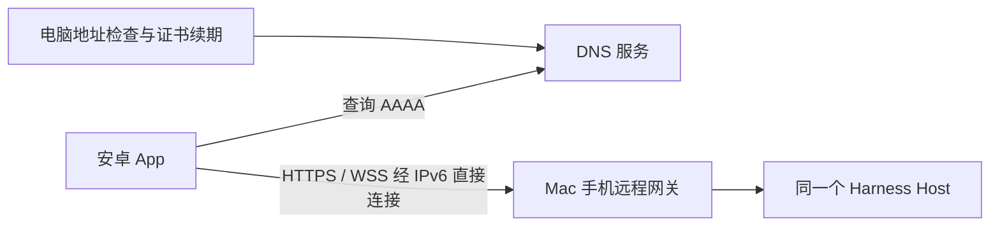

# Harness Remote 安卓客户端设计

状态：设计稿，尚未实现或发布 APK。日期：2026-09-08。

目标：安卓安装软件后，扫码、电脑确认，即可操作同一个 Harness Host。校园网笔记本优先通过公网 IPv6 直连；不要求安装 VPN 软件或导入系统 CA。跨网可达性必须实测，不把“有 IPv6 地址”等同于“外部能访问”。

## 1. 产品与分发约定

**仓库里是插件，Release 中是软件。**

- 当前 `dsh-mobile-remote` 仓库负责电脑端 Harness 插件、协议、文档和插件安装说明。
- 本仓库 GitHub Releases 是安卓软件的正式下载入口，提供签名 APK；用户不需要下载源码或运行 Node.js。
- 插件通过仓库构建 `.tgz` 后安装到 Harness；APK 不能作为 Harness 插件安装。
- 安卓工程拟放在独立源码仓库，名称与地址在开始实现时确定；本轮不创建新仓库。每个 APK Release 必须链接安卓源码提交与匹配的插件提交，确保可以审查来源。
- 当前尚无安卓 Release。README 不展示不存在的 APK 下载链接，也不把设计稿描述为已经可用。

## 2. 连接路线与现实依据

当前笔记本的校园网接口同时存在全局 IPv6 的非 temporary 地址、temporary 地址及 link-local 地址。发布配置选择有效、非临时的全局地址，不使用 `fe80::`、ULA、废弃地址或临时隐私地址；仍监测地址/前缀变化。

参考本机 MuzTool 时发现：其 README 描述 AAAA 直连和 DNS-01 续期；部署文档同时记录校园网到外部运营商可能受限，以及 Cloudflare Tunnel 方案。当前公开域名的 DNS 已指向 Cloudflare。该事实支持复用域名和证书运维思路，但不能作为当前 Mac 已实现校外 IPv6 直连的证据。未修改 MuzTool 或其域名配置。

macOS 会生成临时 IPv6 地址；网络未变化时地址具有稳定性，但不意味着永远固定。[Apple IPv6 安全说明](https://support.apple.com/en-ie/guide/security/seccb625dcd9/web)

### 首选部署

DNS 只提供地址解析，不转发聊天和文件流量。使用专用子域名，例如 `harness.example.com`，不改用其他业务的主域名。AAAA 记录采用 DNS-only；启用代理或 Tunnel 就属于另一条接入路线，不能标为直连。[DNS 记录说明](https://developers.cloudflare.com/dns/manage-dns-records/reference/dns-record-types/)

直连需要同时满足：电脑 IPv6 可路由；校园网允许目标端口入站；Mac 对该网关允许入站；手机当前网络支持可达的 IPv6；HTTPS 域名/证书有效。只放行插件网关，不将原生无远程认证的 Host 端口直接暴露。

### 没有直连条件时

- 同一局域网仍可作为诊断和配对路径，但不冒充跨网成功。
- 手机只有 IPv4、校园网阻止入站、电脑离线时，界面分别给出原因和可执行提示。
- 中继/Tunnel 是可选后续入口，默认不部署、不自动开通、不自动切换公共代理。
- 自有中继可复用已有实现继续适配。Cloudflare Tunnel 的公网 TLS 在 Cloudflare 终止，不能宣称聊天内容对 Cloudflare 不可见。
- 无中继且没有可达直连路径时，明确显示无法连接；不承诺任何网络都能使用。

## 3. 域名、IPv6 与 HTTPS 生命周期

电脑设置提供“IPv6 直连”向导：选择网络接口、检测候选地址、填写专用域名、检查 AAAA、准备证书、验证监听。高级选项允许修改端口；首轮默认保留 8443，只有确认 443 可用并完成对应权限配置后才使用 443。

域名地址有两种管理方式：手动维护 AAAA；或用户配置 DNS 提供商的最小权限凭据后自动更新。首版以一个经过实测的提供商适配为范围，不假定本机 MuzTool 的凭据可复用。DNS 凭据只在电脑保存，不进入二维码、APK、日志或仓库。

地址变化处理：监听网络变化并周期核对；排除临时/废弃地址；短暂等待地址稳定后更新指定记录；显示更新结果与 DNS 缓存过渡状态。没有合适地址时暂停更新并标记离线，不能把其他网卡、VPN 或随机地址写入 DNS。域名始终是客户端保存的入口，IP 只是当前解析结果。

采用公开 CA 签发的域名证书，优先 DNS-01 自动续期，因此不依赖开放 80 端口。证书私钥留在电脑，客户端保持标准证书链、有效期和主机名校验，不忽略 SSL 错误。续期使用现成 ACME 工具及受限 DNS 凭据；设计中不实现自制 CA/加密协议。

插件需增加证书安全重载：新文件成对校验后原子切换 TLS 上下文，失败保留旧证书并提示。续期失败在到期前提示，证书过期禁止客户端静默降级。域名或 Host 身份改变必须重新确认，不能仅因 DNS 指向了新机器就自动迁移授权。

没有域名时，后续可增加原生网络层公钥固定的 IP 连接模式；首版基于可信域名 HTTPS，不通过 WebView 的 SSL-error 放行来实现 IP 模式。

## 4. 用户操作流程

电脑首次设置由管理员完成域名/证书配置；正常用户流程不出现证书路径和中继令牌。

1. 电脑点击“连接安卓手机”，展示两分钟有效、一次性的二维码。
2. 用户从本仓库 Releases 下载 APK；首次侧载由安卓系统确认安装来源权限。
3. App 首页只有“扫描电脑二维码”和已配对电脑列表；扫码时请求相机权限。
4. App 校验二维码格式、HTTPS 域名与协议版本，显示电脑名称，发起待批准申请。
5. 电脑显示手机名称、设备识别信息和权限选项；默认“任务操作”，管理员可改为只读或完整控制。
6. 批准后进入与电脑相同的会话；以后启动自动重连。
7. 电脑可撤销手机；手机可以退出并清除本机授权，不影响 Host 正在运行的任务。

首次配对依赖明确批准，不新增强制云账号，也不复用学校账号、MuzTool 密码或模型 API Key。独立账号密码登录列为后续功能；不能把现有扫码机制描述成已支持密码登录。

二维码包含版本、入口、Host 标识、到期时间和一次性邀请。邀请放 URL fragment 或原生扫码载荷，不进入普通 URL query、访问日志或更新服务。客户端不自动打开不支持的 scheme、任意重定向或二维码内声明的文件路径。

## 5. 安卓实现路线

采用 Kotlin 原生外壳 + 受限 WebView：原生层负责扫码、电脑列表、权限、系统文件选择、下载、更新和通知；会话界面通过可信 HTTPS 加载现有 Harness 原生 Web 客户端。这样复用插件界面与现有会话渲染，不重新实现一套不同步的消息协议。

拟定最低 Android 10；target/compile SDK 与依赖版本在实现时按当时工具链固定并测试。首版发布一个通用 APK，避免用户选择 ABI。原生层不运行模型，也不复制业务 Host。

WebView 只允许当前已配对的精确 HTTPS origin；外部链接交给系统浏览器。禁止文件 URL 访问、混合内容、任意跨 origin 原生桥接和 SSL 错误放行。只有通过来源验证的页面可请求有限的扫码/选文件/下载/通知能力，不暴露执行命令、读取任意本地路径等接口。

沿用 HttpOnly/Secure 设备 Cookie 与网关角色授权。电脑列表可保存域名和显示名称；授权存储与 WebView 数据排除系统云备份，删除电脑时清除对应会话数据。需要额外原生令牌时增加短期、设备绑定的兑换接口，不把长期 Cookie 注入页面 JavaScript。加密密钥使用 Android Keystore，不能把它等同于能直接存放任意令牌的数据库。[Android Keystore](https://developer.android.com/privacy-and-security/keystore)

图片与文件通过系统选择器授权选取；下载只允许授权资源、有限重定向和相同 Host，保存到用户选择的位置。原生下载不得把会话 Cookie 发送到其他域名。原有插件在 WebView 的兼容性需要单独实测，浏览器加载成功不自动算安卓通过。

## 6. 会话一致性与页面

页面：电脑列表、扫码配对、会话列表、对话/轨迹/详情、待审批/问题、设置与设备状态。连接状态统一显示“连接中、已连接、正在恢复、电脑离线、需要重新配对、版本不兼容”。诊断页进一步区分 DNS、IPv6 不可达、端口超时、证书和认证错误。

复用现有网关与共享草稿 API：发送、排队、引导、停止、审批竞争、附件上传、草稿租约/冲突副本、接收回执。发送失败不能自动重发；断线恢复先对账。回执已接收与任务已完成必须分开显示。

重连顺序：校验 Host 身份与 epoch → 获取会话/待办/队列基线 → 恢复事件游标及缺失历史 → 对账操作回执 → 恢复草稿。Wi-Fi/蜂窝切换不能创建第二个 Host 或重复提交。离线编辑在本机保留，联网后按原有 CAS 规则处理。

WebView 的剪贴板、相机、文件上传、音视频、软键盘、返回键和文件预览都纳入真机测试。无论从原生通知还是电脑列表进入，都打开现有会话，不通过重新发 prompt 达成跳转。

## 7. 后台与通知

前台使用现有事件连接；后台不承诺 WebView/WS 永久在线。返回前台后从 Host 补齐历史，即使安卓杀死进程也不能丢失电脑任务。

有 Google Play 服务的设备可选 FCM；没有时首版提供前台提醒和回到 App 后补拉。厂商推送为后续独立适配，不能把 FCM 当作所有安卓手机均具备。持续前台服务只有用户主动选择时启用，并显示系统通知，不默认索要忽略电池优化权限。

推送只携带通用事件提示与不可猜的定位标识，不携带聊天正文、附件路径、审批命令或密钥；点击后重新鉴权读取。推送基础设施与业务中继是两回事：使用通知服务并不意味着聊天流量经过中继。配置与真机验证完成前，不宣称“关闭 App 也能即时通知”。[Android Doze 与 App Standby](https://developer.android.com/training/monitoring-device-state/doze-standby)

## 8. 现有代码与新增范围

| 部分 | 已有能力 | 安卓方案需要补充 |
| --- | --- | --- |
| 网关 | HTTPS、角色白名单、配对、撤销、HTTP/WS | IPv6 监听向导、公开入口硬化与配对限流复核 |
| 共享状态 | 草稿、文件、跟随、回执和断线恢复 | WebView 生命周期、权限与系统交互验收 |
| TLS | 从文件读取并启动 | 域名向导、ACME 调度集成、原子证书重载 |
| 地址管理 | 用户手填 origin/bind | IPv6 筛选、DNS-only 检查、可选 DDNS、诊断 |
| 安卓 | 尚无工程/APK | 原生外壳、WebView、扫码、存储、下载和更新 |
| 中继 | 本地验证过的单 Host 中继 | 保留可选，首版直连成功不依赖其部署 |
| 发布 | 插件打包与 CI | Android 编译、签名、产物溯源、Release 流程 |

公网入口的所有资源和管理能力仍执行设备权限，不因“校园网/IPv6”降低认证要求。对配对、认证及连接数执行限流，诊断接口不泄露配置路径或会话内容。

## 9. GitHub Releases 软件发布设计

发布位置固定为本仓库 Releases。插件版本与 App 版本分别标识，Release tag 采用 `android-v<版本>`，预览版本使用 prerelease。

每次软件发布至少包含：

- `harness-remote-<版本>-android.apk`：正式发布密钥签名，不用 debug key。
- `SHA256SUMS`：所有下载产物的摘要。
- `release-manifest.json`：App 版本、versionCode、最低 Android、协议版本、兼容插件版本范围、两个源码提交及 APK 摘要。
- Release 正文：三步安装、兼容条件、变化、已知限制、验证设备与签名证书指纹。

签名密钥在受限发布环境保存和备份，不进入仓库或 APK；同一应用升级保持签名身份和递增 versionCode。源码仓库 CI 先生成可追溯构建产物，再由本仓库受限发布流程上传并核验摘要；跨仓库只授予必要权限，不让普通 PR 获取签名/发布凭据。正式发布前完成签名校验、覆盖安装和真机验收。

Release 附件清楚命名为安卓软件，不混入同名插件压缩包。GitHub 自动生成的 Source code 压缩包是源码，不是手机安装包，README 与 Release 都要说明。

App 更新先读取发布元数据，再提示用户前往对应 Release 或下载 APK；校验版本、摘要和签名一致性后交给系统安装器，由用户确认。不静默安装、不执行远程脚本热更新、不自动降级。插件过旧时提示电脑更新，手机不越权代替电脑安装。

可采用 GitHub immutable releases 固定发布内容；开启前先用草稿准备并核验所有资产，发布后修复走新版本。[GitHub immutable releases](https://docs.github.com/en/code-security/concepts/supply-chain-security/immutable-releases)

## 10. 实施顺序与验收门槛

1. **网络验证**：确认可用全局 IPv6、监听及证书，用安卓关闭 Wi-Fi 后访问目标域名和指定端口；验证另一外部网络。校园网内自测不能替代校外测试。失败时记录网络边界，再决定是否启用可选中继。
2. **插件接入**：IPv6/DNS/证书向导、DDNS 和证书重载；地址变化、旧证书保留、续期失败及配置回滚测试。
3. **安卓基本版**：独立工程、可信 origin WebView、扫码/批准/撤销、文件、基本更新；模拟器和安卓真机通过。
4. **完整回归**：双端消息/草稿/附件/审批、35 回合以上断线补历史、蜂窝切换、进程重建、后台恢复、现有插件 UI、拒绝权限和过期授权。
5. **Release**：验证签名 APK 首装与覆盖升级、协议不兼容提示、摘要及来源；发布预览版后，完成声明范围内的真机验收才发布稳定版。

通过标准：手机无需装 VPN 或系统 CA；直连时业务请求不经过中继；已确认操作不重复；丢失回执保留待确认；连接故障有明确原因；APK 下载入口和插件安装入口不混淆。

部署前仍需落实：专用域名、DNS 管理授权、校外入站测试、安卓型号/系统、正式签名密钥托管，以及是否启用通知服务。设计稿不代表已申请域名、修改 DNS、开放公网端口或发布软件。
