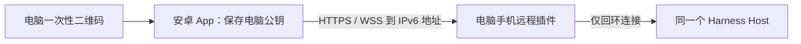

# Harness Remote 安卓客户端：IPv6 地址直连

实现版本：插件 0.2.1 / Android 0.2.0-preview.2。Android 10 起，target SDK 36。发布前的验证记录见 `android-validation.md`。

## 产品与分发

**仓库里是插件，Release 中是软件。** 本仓库维护电脑插件；[独立安卓源码](https://github.com/y38501148-max/harness-remote-android)维护 Kotlin App。安卓签名 APK 发布在[本仓库 Releases](https://github.com/y38501148-max/dsh-mobile-remote/releases)，名称为 `harness-remote-<版本>-android.apk`。GitHub 自动生成的 Source code 不是安装包。

用户明确选择直接使用 IPv6 地址，因此不申请域名、不配置 DNS、不使用 ACME，也不要求安装 VPN 或导入系统 CA。Codex Remote 的官方说明包含安全中继层；这里借鉴扫码和可信设备体验，网络使用电脑网关直连，不能把两种实现说成相同。[Codex 远程连接](https://learn.chatgpt.com/docs/remote-connections.md)

## 连接与电脑身份

1. 电脑「设置 → 手机远程」检测有效、非临时的公网 IPv6，默认端口 8443。
2. 开启直连时生成持久私钥和带当前 IP SAN 的自签名证书。私钥保存在状态目录下，文件权限 0600。
3. 二维码 fragment 携带版本、IPv6 HTTPS origin、Host ID、公钥 SHA-256、两分钟有效的一次性邀请和到期时间。
4. 手机原生网络层严格校验扫码公钥、证书有效期、自签名和 IP SAN，再读取 `/remote/info` 验证 Host ID 与协议。
5. 手机提交设备名称；电脑明确批准只读、任务操作或完整控制。未批准的设备不能读取会话或资源。
6. 授权 Cookie 由原生 CookieJar 管理，只接受 Secure、HttpOnly、host-only、path `/` 的网关 Cookie。AES-GCM 加密后存入应用私有偏好，包装密钥留在 Android Keystore；备份关闭，JavaScript 收不到 Cookie。

只有公钥相符的电脑能够续用授权。App 不提供忽略证书错误开关，WebView 的 SSL 错误处理只调用 `cancel()`。

## 地址和证书生命周期

电脑每 30 秒检查所选接口：排除 link-local、ULA、临时、废弃和 tentative 地址；优先保留当前地址。新地址需连续两次观察后才更新。没有合适地址时保留身份并显示网络错误，不随机切换到别的接口。

证书默认 365 天，在剩余 30 天或 IP 变化时重签。续期继续使用同一私钥，因此手机保存的公钥不变。新证书先校验，再热更新 TLS 上下文和证书文件；失败保留或恢复旧上下文。Host 重启仍恢复已开启的入口。

**没有域名或发现服务，就不能自动知道电脑的新 IPv6。** 地址变更后，在 App 的电脑管理中填写新的 `https://[IPv6]:8443` 并验证原公钥，或重新扫描电脑二维码。电脑重装或私钥丢失则重新配对。

跨网直连必须同时满足：电脑地址可路由；校园网和 Mac 允许该端口入站；手机当前网络有可达 IPv6；电脑 Host 在线。只有 IPv4 的手机网络不能直连 IPv6。校园网内部成功不等于蜂窝成功；本地模拟器测试不冒充校外验收。可选中继是另一条明确配置的路线，不自动开通。

## 安卓界面和传输

Kotlin 原生外壳负责电脑列表、扫码、地址管理、文件选择和保存、更新入口及可选通知。会话界面复用当前 Host 的 Harness Web 客户端，继续支持文字、图片/文本文件草稿、队列、引导、停止、审批、问题、工具和原插件界面。

WebView 仅允许当前电脑的精确 HTTPS origin。AndroidX 在文档开始时安装受限传输适配器；原生 OkHttp 负责公钥固定的 HTTP/WS。API 请求与响应按块传递，保留 RPC ID、Host epoch、状态码、错误和取消语义。页面资源/音视频 Range 通过原生流读取；不使用 SSL-error 放行。跨 origin 桥接、子帧原生调用、文件 URL、混合内容和自动外部跳转被拒绝。用户点击外部链接时交给系统浏览器。

App 复用原有接收回执和 CAS/租约逻辑，不自动重发写操作。断线由原生客户端恢复事件/历史基线；进程重建后从加密存储恢复配对，再加载同一 Host。删除电脑清除本机授权，电脑任务继续运行。电脑端可以撤销手机。

图片和文件由系统选择器授权选择；下载只能来自当前电脑的授权资源，保存到用户指定的位置。原生下载不跟随跨 origin 重定向、不把 Cookie 交给系统下载器。大文件使用流传输，不在 JavaScript 桥中整体缓存。

## 后台与通知

默认不运行常驻服务。App 顶部「提醒」可主动开启持续任务提醒，并按需申请通知权限。前台服务保持到电脑的事件连接，任务结束、审批和问题只发送通用通知，不包含正文、路径、命令或密钥。点击通知重新进入已配对电脑；无需 FCM 或云账号。

服务显示常驻通知，可随时停止；连接中断按退避策略恢复。Android 对 dataSync 前台服务有时长与电量限制，系统超时会停止服务。App 不索要忽略电池优化权限，也不承诺结束进程、强制停止或离线时即时通知。返回 App 后补齐电脑上的任务。

## 版本与发布

插件和 App 分别标识版本；本次共同使用协议 1，最低插件版本 0.2.0，Harness 适配目标 rc.6。App 通过 GitHub 公共 API 查询本仓库安卓 Releases，再让用户进入固定下载页。安装和升级由安卓系统完成，签名身份必须一致，不静默安装、不远程执行脚本、不自动降级。

每次发布提供：签名通用 APK、`SHA256SUMS`、`release-manifest.json`（Android 与插件源码提交、版本/协议、APK 摘要、签名证书 SHA-256、最低 Android）。发布 tag 为 `android-v<版本>`；预览版标记 prerelease。签名密钥不进入源码或 APK，同一应用升级保持同一密钥和递增 versionCode。

安卓仓库 CI 编译并测试；电脑仓库发布入口记录两个提交。签名产物从受限发布环境生成，Release 资产核验后发布。模拟器、签名/覆盖安装、插件回归与用户真机的验证结果分别记录；未完成的真机或蜂窝项目不声明通过。
