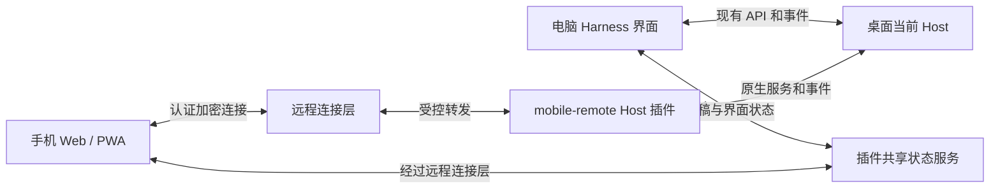

# DeepSeek Harness 手机远程控制插件：初步计划

日期：2026-09-08
状态：已完成本机代码与官方功能调研；尚未实现、安装或开启远程服务。
拟用插件名：`@muzermat/dsh-mobile-remote`；开发目录：`plugins/mobile-remote/`。

## 1. 目标与推荐方案

让手机成为本机 DeepSeek Harness 的完整操作端。手机与电脑连接**同一个正在运行的 Host、同一组会话和同一个执行队列**，共享会话内容、实时输出、任务状态、交互请求、设置与已适配插件状态；手机可以创建和继续任务、发送消息、引导运行中的任务、停止任务、回答问题和审批。

推荐采用 **Harness Host 插件 + 复用现有 Web 客户端的手机适配 + 经过认证的远程连接层**。首个客户端形态采用手机浏览器/PWA，覆盖 iOS 与 Android；保留后续原生客户端使用同一协议的空间。PWA 选型为初步工程假设，尚未做真机验证。

完整目标包含外网接入、后台恢复、附件与产物、共享草稿和现有插件兼容。分阶段实现不改变最终范围；第一阶段的局域网连通演示不能作为最终交付。

“操控电脑端”在此包含 Harness 内的全部业务操作，以及让电脑端跟随手机切换会话和工作面板。控制整个操作系统的任意鼠标/键盘是另一项远程桌面能力；本计划通过 Harness 的现有工具继续执行电脑与浏览器任务，并同步其可见输出。

## 2. Codex 功能参考与事实边界

已打开并核对的官方资料：

- [Codex Remote](https://learn.chatgpt.com/docs/remote)：手机启动、指导、审批与审查电脑上的任务；扫码建立连接。
- [Remote connections](https://learn.chatgpt.com/docs/remote-connections)：沿用主机环境与工具，支持通知、终端输出和截图；使用安全中继，主机需要在线且保持可用。

这两页用作产品行为参考。它们没有给出可直接复用的完整手机传输协议、同步算法或中继服务实现。下文的事件恢复、幂等、共享草稿和配对设计是本项目方案，不是对 Codex 内部实现的断言。

## 3. 本机已确认的实现基础

本仓库 `package.json` 固定 `@deepseek-ai/dsh` 为 `0.1.0-rc.6`。工作目录当前没有根 `node_modules`；本次进一步检查的是已安装应用内相同版本的实际 JS、类型声明和随包文档：

```text
/Applications/DeepSeek Harness.app/Contents/Resources/host/node_modules/@deepseek-ai/
```

| 已确认内容 | 本机证据 | 对实现的意义 |
| --- | --- | --- |
| Electron 启动并持有一个 Web Host，加载其实际 URL；Host 端口可由系统分配 | `desktop/src/main.ts`、`desktop/src/host-supervisor.ts` | 插件必须绑定桌面当前 Host，不能假定端口始终是 3080，也不能另起 Host 来模拟同步 |
| 普通关闭窗口隐藏窗口，明确退出才释放 Host | `desktop/src/window-lifecycle.ts` | 有常驻基础；防休眠尚需桌面集成 |
| 本地插件具备 Host 入口、Web 客户端入口、Cordis patch、设置页插槽 | `plugins/repair/package.json`、`src/index.js`，其他本地插件 | 沿用 Harness 插件结构，不使用 Codex 的插件清单格式 |
| 操作由 HTTP POST 承载；两条只下行 WebSocket 分别是 `/api/events.mux` 和 `/api/events.host` | `dsh-client-connection/README.md`、`lib/index.js` | 手机可沿用原协议、客户端状态层和渲染器 |
| 会话具有历史、prompt、queue/steer、cancel、rename、附件读取等接口 | `dsh-client-runtime/lib/types/client/contract/session.d.ts` | 主要对话操作已有 Host 入口 |
| 客户端维护 `liveBuffer`、`subscribedLastSeq`、重连 generation 和历史缺口拼接 | `dsh-client-runtime/lib/types/client/sessions/session.d.ts` | 优先验证、复用已有恢复机制 |
| `events.mux.since` 目前被忽略，重连需要重开流并读取历史 | `dsh-host-apiproxy/lib/types/api/events.d.ts` | 不能将现状称为完整游标续传 |
| 新连接收到待审批、待回答、待发送队列、后台任务的基线 | `dsh-host-apiproxy/lib/index.js` 的 `events.mux()` | 切换到手机后可恢复待办交互，不只显示文本 |
| Host 校验审批/回答对象；已结束请求返回 `not-pending` | 同文件的 `respond()` | 可实现两端只接受一次决定；需并发测试 |
| 会话存储保留 `assistant/chunk`；压缩行可无损还原序号和时间 | `dsh-session-persistence-jsonl/README.md` | 已保存的流可以恢复，不能直接逐行解析压缩 JSONL |
| `session.prompt` 记录 `source.rpcId`，但所读 admission 路径未见重复请求去重 | `dsh-host-apiproxy/lib/index.js` 的 `prompt()` | 丢失回执后不能直接自动重发 |
| 浏览器访问有 Host/Origin 校验；配置与部分本机操作限定 loopback；没有设备身份认证 | `dsh-client-connection/README.md` 与实现 | 需要新增认证边界及有权限控制的配置适配 |
| 现有自定义插件存在组件内 draft、进程内 mode 等状态 | `plugins/ui-tweaks/src/client-body.js`、`plugins/harness-modes/src/client-body.js` | 打开同一个网页不会自动同步所有交互状态 |

证据优先级：实际函数与类型定义优先于包 README。例如连接包文档称历史读取可能恢复 Agent，但 API Proxy 文档及代码提供 cold-log 读取路径；具体恢复行为应在原型阶段进一步验证。

本次未读取用户会话正文、密钥文件或修改运行中的 Host 配置；上述结论来自程序代码和文档，尚未经过手机实测。

## 4. “双端完全同步”的可验收定义

| 同步面 | 最终行为 | 需要的工作 |
| --- | --- | --- |
| 项目与会话 | 列表、标题、分组、排序、创建/删除及已有会话管理操作在两端一致 | 复用 Host 目录与事件；盘点浏览器私有状态 |
| 会话时间线 | 用户消息、正文增量、电脑当前可见的 reasoning 区块、工具调用/参数/结果、错误、重试、用量信息一致 | 原生事件与渲染复用；未知事件保留可见回退；不推断或生成模型未暴露的内部内容 |
| 运行状态 | 运行、排队、停止、失败、完成、目标/计划、子代理和后台任务状态一致 | 复用 mux/host、投影和任务接口 |
| 双向操作 | 手机或电脑发送、排队、steer、编辑队列、取消后，另一端收到 Host 的权威结果 | 统一命令身份、确认与失败状态 |
| 提问与审批 | 两端出现相同请求；一端处理后另一端及时移除待处理状态 | 复用 Host 请求身份和一次性决定语义 |
| 草稿与待上传附件 | 同一会话的未发送输入在两端可继续；不覆盖另一端尚未同步的文字 | Host 草稿服务、版本检查、上传引用、冲突副本 |
| 当前会话与面板 | 默认联动工作位置，手机可切换电脑当前会话/面板；可显式退出跟随 | 新增 UI 状态服务与控制租约，避免两端争抢焦点 |
| 模型、模式与设置 | 手机看到 Host 的真实选择，可执行与其设备权限相符的修改；改变同步给桌面 | 配置适配和版本冲突检测；处理本地 mode 状态 |
| 插件 | 已适配插件的 UI、数据、控制结果同步；兼容状态明确可查 | 插件逐项清单与远程适配契约，不能假定任意 DOM 插件自动兼容 |
| 文件与媒体 | 手机上传附件，查看/下载生成物、图片、diff、工具返回的截图 | 授权资源地址、媒体渲染和传输进度；替换电脑绝对路径直链 |
| 终端和浏览器 | 同步 Harness 已有工具输出与截图；需要时通过专用面板控制 | 独立 PTY/预览接口能力盘点；“终端输出”不等于连续 PTY 镜像 |
| 离线与恢复 | 显示连接状态和最后同步位置；恢复后补齐，不重发已执行操作 | 网络恢复、命令对账和后台唤醒 |

业务数据由 Host 定序后同步；网络断开时不可能保证两端实时一致。验收要求是在线时及时收敛、离线状态明确、重连后无静默缺失或重复操作。主机崩溃前未落盘的事件、进程内队列与 PTY 不能被宣称可天然恢复。

布局按手机屏幕适配。滚动位置、展开状态也进入同步能力清单，但通过跟随模式传播，避免阅读时相互抢动。密钥的使用仍在电脑发生；手机同步其已配置状态和授权的设置操作，不将凭据原文复制为会话或离线缓存。

## 5. 组件划分



### A. Host 插件

- 注入实际可用的 `webServer`、`apiProxy` 及所需服务；使用 `ctx.webServer.port` 获取当前实例端口。具体 API 导出与插件卸载顺序在 P0 校验。
- 提供远程开关、一次性配对、设备撤销、连接状态、会话与操作授权、操作审计。
- 复用现有 API 和事件；补充共享草稿、界面状态、幂等命令与资源访问。
- 配对、撤销、TLS 会话、共享状态属于插件；会话历史继续由 Host 原生会话服务负责。
- 插件关闭只断开远程连接并回收资源，不取消原本在运行的任务。

### B. 手机客户端与桌面客户端扩展

- 首选复用现有 Web 客户端和插件模块，增加响应式导航、输入区域、安全区与触屏操作。避免维护另一套会话解析器。
- 桌面和手机均加载共享状态扩展，接入现有输入和导航服务。不得通过轮询 DOM 文本实现会话同步。
- 远程资源代理覆盖 HTML/JS/CSS、插件 bundle、HTTP 操作、两条 WS、附件、导出和必要的预览路由；采用明确清单，防止漏掉另一条事件流或任意开放插件路由。
- 原生“选择目录”改为手机可用的 Host 目录选择；“打开路径”在手机显示预览，并可另行向电脑发送打开请求。

### C. 网络接入

1. **原型验证**：在受保护测试网络或认证的 HTTPS 入口下直连同一 Host，验证协议和移动适配。认证必须先于跨设备写操作开放。
2. **日常使用**：提供电脑主动发起的加密中继通道，以支持手机蜂窝网络与不同 Wi-Fi；Host 继续监听 loopback。
3. 保留私人网络直连作为可选连接方式。中继部署位置、域名和运行成本留到功能原型通过后确定，本轮不部署。

若中继终止 TLS，默认它可以接触业务内容；必须在设计中明确这一信任边界。需要中继不可读时，采用经过验证的端到端加密通道，并覆盖附件与控制消息；不能仅因为用了 WSS 就声称端到端加密，也不自行发明加密协议。

PWA 后台长连接不可作为持续在线保证。手机前台接收实时流，回到前台执行对账；后台完成/待审批提醒采用系统允许的通知机制。通知真机能力在 P0 核实，无法满足要求时追加原生壳或原生客户端，不缩减同步目标。

## 6. 一致性和操作可靠性

### 6.1 原生事件优先

- 使用 Host 原生 sessionId、事件 seq 与投影水位，不重新给原生历史排号。
- 新连接先建立事件接收与缓冲，再读取权威历史/状态基线，用同一切点拼接期间收到的事件；不能先读历史再订阅而漏掉中间事件。
- 先验证现有客户端重连拼接是否覆盖长断线、长工具输出和多页历史。`since` 未实现期间必须明确使用“重新读取并补齐历史”。
- Host 重启更换 `hostEpoch`；重置临时状态水位，重新读取待办、队列、jobs 和投影。插件状态另有独立 revision，不能与原生 seq 混用。
- 若现有补齐不能满足性能或完整性，再补 Host 的游标续传能力；这是候选主程序扩展，不预先重写事件系统。
- 慢手机需要背压和分块处理；达到缓冲上限后显式要求重新同步，不能静默丢 token 后仍显示“已同步”。

### 6.2 命令去重和回执

新命令封装拟包括 `commandId`、`deviceId`、`hostEpoch`、目标会话、操作与参数；需要版本条件的操作另带 `expectedRevision`。字段为拟议协议，不是当前 Harness API。

- 每次用户明确发送产生一个稳定 commandId；网络重试保持该 ID。
- Host 记录接收和处理结果，两端区分“待发送 / 已接收 / 已执行 / 被拒绝 / 结果待确认”。
- 幂等检查必须覆盖真正的操作接收边界。仅在代理中缓存 HTTP 回包，不能解决“Host 已执行、代理尚未记账就崩溃”的间隙。
- 优先将稳定命令身份关联到 Host admission/消息身份和持久记录；若当前接口不允许原子接收，P0 明确最小 Host 改动。
- 无法确认结果时先查询命令记录、队列和历史，不自动重发有副作用的请求；保留原始输入供用户核对。
- 当前待发送队列是进程内状态。跨 Host 重启恢复队列需要单独持久化 admission/inbox 方案；否则必须明确标记队列丢失或结果待确认，不能回报“已经执行”。

### 6.3 两端同时操作

- Host 决定独立消息的接收顺序；相同 commandId 只接受一次，同文但不同的用户发送仍可各自接收。
- 审批/问题复用原请求身份；第一个有效决定生效，另一端显示已由另一设备处理。过期请求不重新创建。
- 草稿使用 Host revision 和短期编辑租约；另一端接手后原编辑者的未同步修改保留成冲突副本。不能静默用最后写入覆盖文字。
- 发送草稿时提交其 revision；清空操作只作用于对应草稿版本，不能删掉发送期间另一端新输入的文字。
- 模型/预设切换、队列修改、重命名、配置修改按其原生语义执行；有并发覆盖风险时增加版本前置条件。
- 跟随会话、面板、光标等 UI 状态与业务事件分开；跟随控制租约有超时和可见接管入口。

### 6.4 配对与权限

- 桌面显示短时有效、单次使用的扫码邀请；手机提交设备身份，桌面确认设备后建立长期授权。
- 每台设备可撤销；撤销立即关闭存量 HTTP/WS 通道并使旧令牌失效。
- 同一认证边界覆盖页面、API、升级握手、下载、插件路由与共享状态。扫码码值不作为永久 bearer token。
- 校验 Host、Origin、CSRF、请求大小、上传资源归属与会话权限；浏览器凭据采用适合该传输的安全存储方式。
- 配置、本机打开文件、插件管理等操作使用明确权限。网关不能简单将任意远程请求改写为 loopback，从而自动获得全部本机权限。
- 不改变已有工具审批与 sandbox 策略；完整控制设备可以执行授权的管理操作，但这些操作仍由 Host 校验。

## 7. 实施阶段与交付物

| 阶段 | 工作 | 可验收交付 |
| --- | --- | --- |
| P0：接口与双端原型 | 在隔离测试 Home 中恢复开发依赖；两客户端连接同一个测试 Host；核查插件注入、HTTP/WS、移动输入、幂等扩展点、PWA 真机约束 | 原生接口矩阵、现有插件兼容清单、双端消息/流/审批实验报告、需要主程序修改的明确列表 |
| P1：认证与基础远控 | 插件骨架、设备配对/撤销、同一 Host 路由、手机 UI 适配、项目/会话浏览、消息发送和停止 | 手机发消息后电脑同一会话出现；电脑输出逐步到达手机；未授权设备不能读写 |
| P2：同步可靠性 | 命令去重、网络切换、历史补齐、队列/审批/问题恢复、两端并发和失败显示 | 断线恢复无缺失、重复发送无重复执行、两端竞争审批只生效一次 |
| P3：完整工作状态 | 草稿/附件草稿、界面跟随、模型与设置、计划/目标/子代理/jobs、文件/媒体/diff、现有插件逐项适配 | 完整同步矩阵逐项通过；手机可继续电脑尚未发送的输入并操控工作面板 |
| P4：外网与后台 | 中继接入、蜂窝网络恢复、设备在线状态、后台通知、桌面防休眠选项 | 不同网络下真机使用；关闭桌面窗口后仍能远控；退出 Host 明确离线 |
| P5：发布与回归 | 安装/升级/卸载、版本协商、现有插件回归、长会话性能、设备撤销和异常恢复 | 可安装插件包、用户说明、兼容报告、已知限制及回滚路径 |

按依赖顺序推进，完成 P0 后再根据实际改动范围估算工期。纯插件预计能覆盖接入、手机 UI 与共享状态；主程序扩展候选为原子幂等接收、队列持久化、缺失的 UI 服务接口、特权配置授权和桌面防休眠。是否必须修改各项以 P0 实验为准。

建议目录：

```text
plugins/mobile-remote/
  package.json
  cordis.patch.yml
  build.mjs
  src/index.js              # Host 激活与资源释放
  src/client-body.js        # 设置页、手机适配和双端共享状态接入
  src/protocol/             # 版本、命令和状态契约
  src/auth/                 # 配对、设备和会话
  src/gateway/              # 原生 API、事件与资源适配
  src/sync/                 # 草稿、界面状态和命令对账
  src/mobile-remote.css
  tests/
  README.md
```

中继服务作为可独立部署组件，协议与插件共享版本约定。不要求插件使用者安装 Codex 或拥有 OpenAI 账号。

## 8. 核心验收场景

1. 电脑生成长回复中途手机接入，恢复已生成部分并连续接收后续正文、可见 reasoning、工具事件；结束后两端规范化时间线一致。
2. 手机发送后电脑同一会话出现该消息；电脑发送后手机出现；同时发送按 Host 顺序显示。
3. 手机在 Host 接收后丢失回执，多次重试仍只接收一次；模拟进程在 admission/记账之间崩溃，正确对账或显示待确认。
4. 单独断开 mux 或 host WS、Wi-Fi 切蜂窝、锁屏再打开、离线期间跨多页历史，恢复后无静默缺口、重复内容或错误 running 状态。
5. 两端同时回答/审批，只有第一个有效决定生效；旧页面不能批准已经失效的操作。
6. 两端同时编辑草稿，所有输入可找回；一端发送不能清空另一端较新草稿；附件上传中切换设备能识别尚未完成的上传。
7. 从手机切换电脑会话/面板；电脑接管后手机状态更新；退出跟随后各端浏览位置互不抢夺。
8. 长会话、多个并行任务、大附件、慢手机下验证限流、背压、分页与资源内存上限。
9. 逐项核查 `ui-tweaks`、`harness-modes`、`repair`、`browser-view`、`newapi-monitor`、`haibara-ai`、`step-narrator`、routing suite 的显示与操作；功能不适用手机时提供可见的远程操作方式或具体待适配项。
10. 含图片、文件链接、终端输出、diff、截图的结果可在手机查看；不存在打不开的电脑绝对路径链接。
11. 关闭电脑窗口仍可用；退出程序、Host 崩溃、主机睡眠均明确显示不可用，不声称任务仍在继续；恢复后重新获取真实状态。
12. 撤销设备后现有连接立即失效；未配对、伪造 Origin、越权会话/资源、路径穿越和过期邀请均被拒绝。

建议测量指标（是工程目标，尚非实测）：局域网可见流同步延迟 p95 ≤ 300 ms；稳定跨网条件下 p95 ≤ 1 s；小型会话恢复后 5 s 内完成对账。测试记录网络 RTT、负载和历史规模；大型历史采用分页并显示恢复进度，不能以固定延迟掩盖未补齐状态。

最终验收以“同一 Host 执行、全部约定状态收敛、操作没有静默重复、现有插件兼容清单完成”为准。当前完成的是方案与源码证据整理；下一实施单元是 P0。
